# Catia Project screw nut mechanism

## 1) Introduction – electric drives of robots

Electric drives are an essential aspect of robots and key players in transforming them into functional entities. They enable robots to move, perform precise tasks, and interact with their environment in a controlled and efficient manner. Electric drives play a crucial role in transmitting and transforming electrical energy into mechanical motion, thus allowing robots to perform a wide range of operations.

An important aspect is the development and application of electric motors, such as direct current (DC) motors and alternating current (AC) motors, in robotic drives. These motors are used to generate the necessary torques and speeds for different applications and degrees of freedom of robots (Zhu, Lu, Jiang, & Yu, 2021).

Another important research area in electric drives of robots is their control and regulation. The use of advanced algorithms and control techniques such as PID (Proportional-Integral-Derivative) control, adaptive control, and machine learning control allows the optimization of the performance of electric drives in terms of precision, speed, and energy consumption. An emerging research theme in electric drives of robots is represented by direct drive technologies, such as piezoelectric motors and magnetic levitation motors. These innovative technologies offer the possibility of achieving exceptional precision and control in robot movement, being used in applications that require extremely accurate positioning or where vibrations and noise must be minimized (Feng, Rajapaksha, & Jakli, 2021).

In addition to technological development, studies in the field of electric drives of robots also aim to optimize energy efficiency. By using more efficient drive systems and advanced control algorithms, researchers and engineers strive to reduce the energy consumption of robots, thus contributing to the development of more sustainable and environmentally friendly systems.

## 2) 3D Modeling of the System

### 2.1) System Presentation

The screw-nut motor system is a mechanical combination that converts rotational motion into linear motion. This system is used in a variety of applications, including CNC machines, 3D printers, elevators, and many others.

The operation of the screw-nut motor system is based on the principle of transforming rotational motion into linear motion. The motor generates rotational motion, which is transmitted through the screw to the nut. Due to the threading, the nut moves up or down the screw depending on the direction of the motor's rotation.

This linear motion of the nut can be used to move or actuate other components or mechanisms in a linear direction. By controlling the speed and direction of the motor's rotation, the linear motion of the system can be controlled in a precise and repeatable manner.

### 2.2) 3D Image of the Assembly

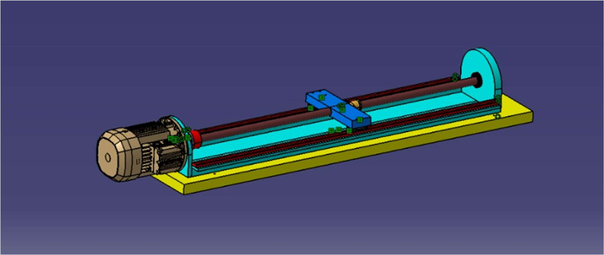

### 2.3) List of Components in the Assembly

| No. | Name                | Quantity | CAD Image | Characteristics                                                                 |
|-----|---------------------|----------|-----------|---------------------------------------------------------------------------------|
| 1   | Motor               | 1        |      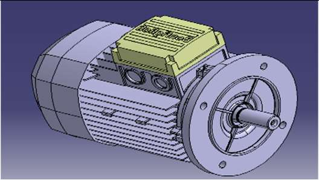     | Provides the necessary energy to drive the screw based on its rotation;         |
| 2   | Linear Bearings     | 2        |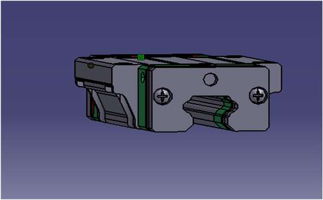           | Minimizes friction and ensures smooth and precise operation of the system;      |
| 3   | Rail Guide          | 2        |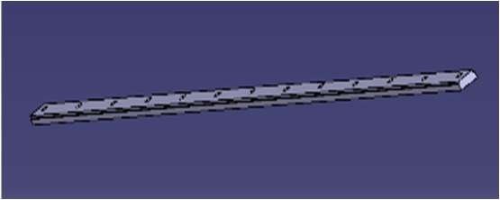           | Provides support and guidance for the screw during its rotation;                |
| 4   | Elastic Coupling    | 1        |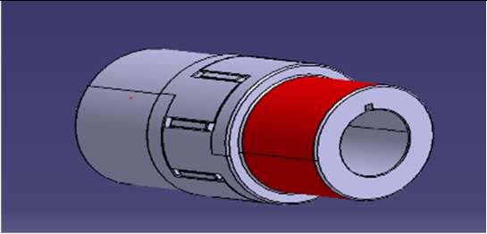           | Provides support and guidance for the screw during its rotation;                |
| 5   | Base Plate          | 1        |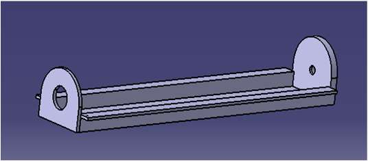           | Provides support and guidance for the screw during its rotation;                |
| 6   | Table               | 1        |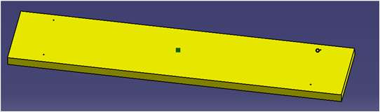           |                                                                                 |
| 7   | Screw Mount         | 1        |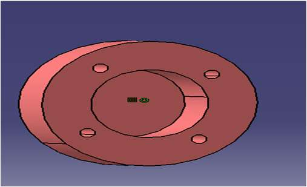           |                                                                                 |
| 8   | Screw               | 1        | 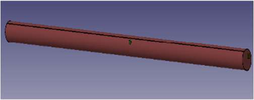          | Generates rotational motion;                                                    |
| 9   | Nut                 | 1        | 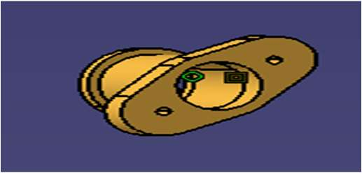         | Ensures movement along with the screw.                                          |

### 2.4) 2D Drawings of the Assembly with Dimensions

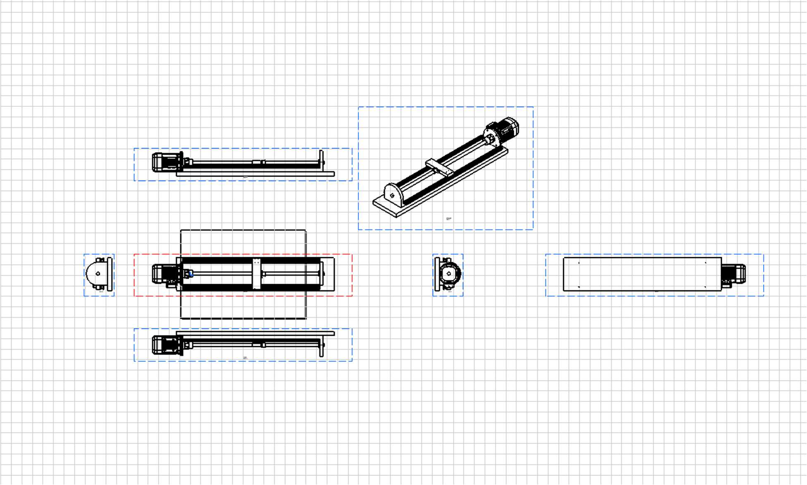

## 3) Sizing Calculations and Selection of the Electric Motor

### 3.1) Work Cycle Diagram

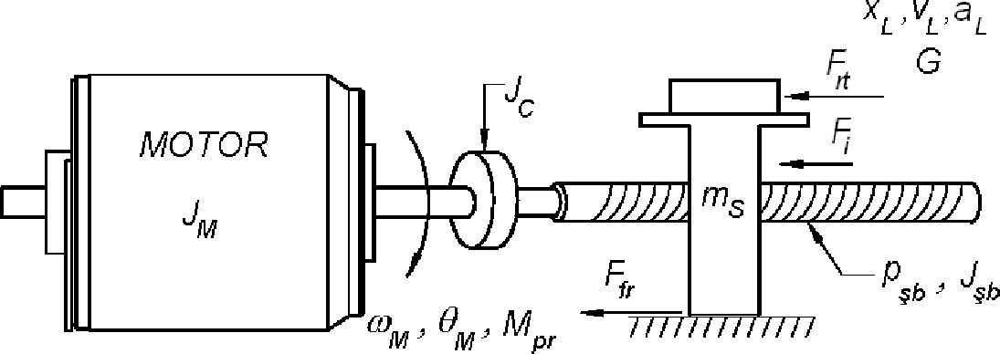

### 3.2) Input Data: Motor Type: Three-phase asynchronous

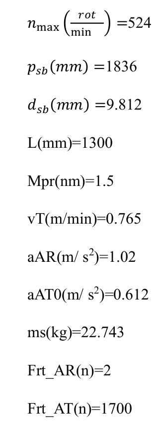

Calculation of the maximum linear speed of the load during the rapid approach and rapid retraction phases:

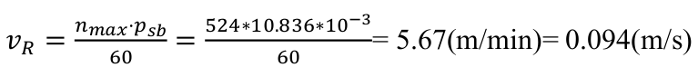

### 3.3) Determination of Static Torque

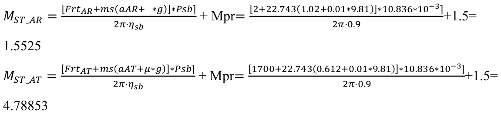

We will select a three-phase asynchronous motor from the Bonfiglioli BN-BE-BX series catalog, considering the following specifications and design conditions: For the calculation of the required torque, we consider µ = 0.01 as the friction coefficient in the guides and ηsb = 0.9 as the efficiency of the ball screw-nut transmission. We also consider g = 9.81 m/s^2 as the gravitational acceleration. To ensure a safety factor, we will choose a higher torque value, in this case, Mst_AT = 4.78853 Nm, and add a 50% margin of error, which means an additional 2.39 Nm. Thus, we will need a motor that can provide a minimum torque of 7.18 Nm. Based on these requirements, we will look for a suitable motor in the Bonfiglioli BN-BE-BX series catalog that meets the required specifications.

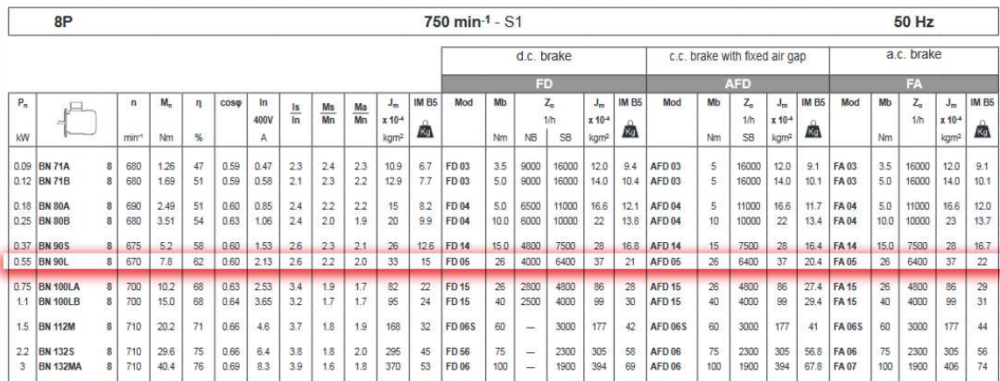

### 3.4) Preliminary Motor Selection

Preliminary selection: motor BN 90L, 0.55 kW, 7.8 Nm, n = 670 rpm, and Jm = 33*10^-4.

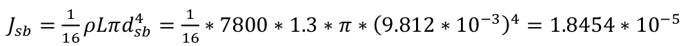

where ρ - the density of the body [kg/m3], for steel ρ=7800 kg/m3

Total Moment of Inertia:

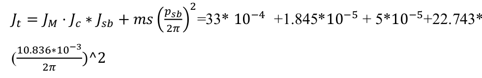

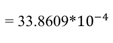

where  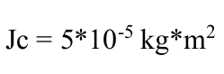

We calculate the angular acceleration of the motor during the AR and AT phases:

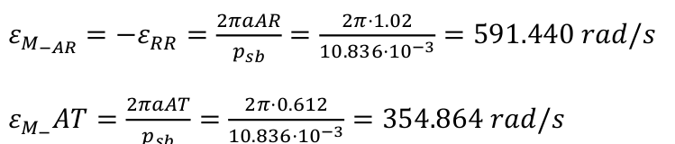

### 3.5) Determination of Dynamic Torque

We calculate the dynamic torques during the AR and AT phases:

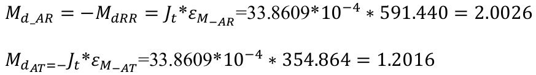

### 3.6) Verification of Selected Motor

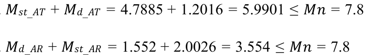

The selected motor meets all the necessary requirements and conditions, so it will be the final choice for this project.

### 3.7) Motor Characteristics Presentation 

The BN 90L motor is part of the BN-BE-BX series from the manufacturer Bonfiglioli and has the following specific characteristics:

- Nominal power: 0.55 kW (kilowatts)
- Nominal torque: 7.8 Nm (newton-meters)
- Nominal speed: 670 rpm (rotations per minute)
- Motor inertia: Jm = 33 * 10^(-4) (kilogram per square meter or kilogram per square centimeter, depending on the unit specified in the manufacturer's specifications)

These characteristics provide information about the motor's capacity to generate power, the maximum torque it can develop, the nominal speed at which it operates, and its inertia, which indicates the response to changes in speed and acceleration.

## 4) Electric Drive Diagram

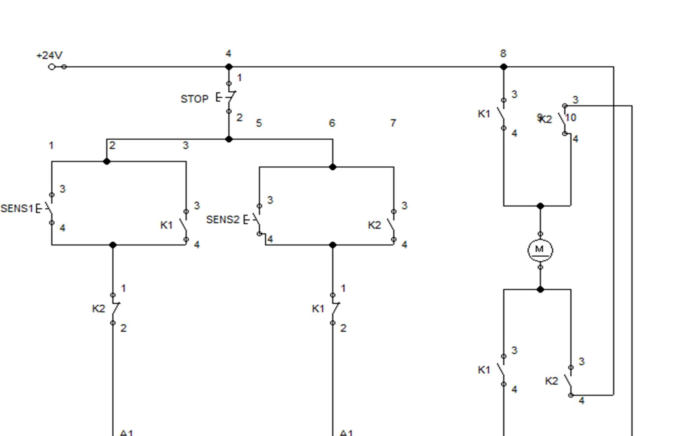

### 4.1) Electrical Diagram

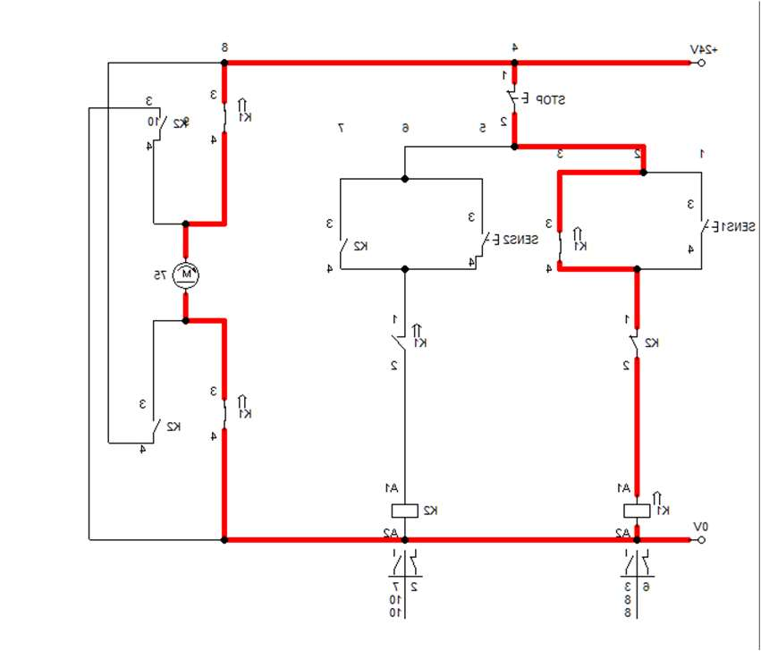